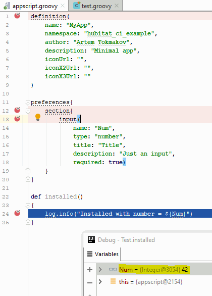

# Hubitat CI

This is a library for unit testing Hubitat scripts locally (and via **C**ontinuous **I**ntegration, thus Hubitat CI).

In short, it uses [GroovyShell](http://docs.groovy-lang.org/latest/html/api/groovy/lang/GroovyShell.html) to load the scripts, make objects out of them and let user test them.

## Features
### Debug your script
With proper IDE (I'm using [IntellijIDEA](https://www.jetbrains.com/idea/)), you can step through your tests **and your script**, view variables and have rich debugging experience in general.

### Have basics validated automatically for you
By default, the library will initialize script object, and perform its validation.

These validations can catch errors like these:

- [using 'int' instead of 'number' for input type](https://github.com/bspranger/Hubitat_iComfort/pull/5/commits/ebc2fa7ef38d41412fffe59da969ea97a2235334)
- [removing accidental writes to global state](https://github.com/bspranger/Hubitat_iComfort/pull/4/commits/48283ff2393a6bb9d65e7536be8952f2ffa90a71)
- [detecting unsupported parameters](https://github.com/mihaca/homeremote/pull/1/commits/2191d06101185170afa7eed2ae73a34de4bfdc1a)
- Use of [unsupported APIs](https://docs.smartthings.com/en/latest/getting-started/groovy-for-smartthings.html#restricted-methods)
- Validate command and capabilities method signatures and names
- And many more...

## Getting started
1. [Install Gradle](https://gradle.org/install/) build system.
2. Look at a [minimal project sample (for app)](https://github.com/biocomp/hubitat_ci_example/tree/master/minimal) as a basis, use your own script instead of  `appscript.groovy`.
3. run `gradle build` from the same folder where `build.gradle` and your script are.

This will build and run the test, which, in turn will load and validate your script.
