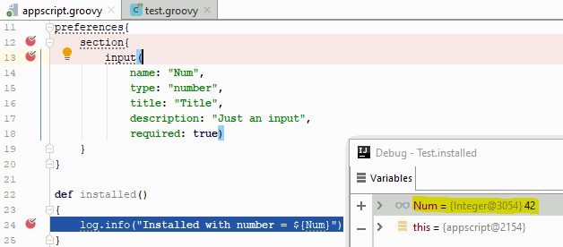

# Hubitat CI

This is a library for testing Hubitat scripts locally on your machine (and via **C**ontinuous **I**ntegration, thus Hubitat CI).

In short, it uses [GroovyShell](http://docs.groovy-lang.org/latest/html/api/groovy/lang/GroovyShell.html) to load the scripts, make objects out of them and let user test them.

## Features
### Debug your script
With proper IDE (I'm using [IntellijIDEA](https://www.jetbrains.com/idea/)), you can step through your tests **and your script**, view variables and have rich debugging experience in general.

### Run your tests in the cloud after (or before) every push
Just something obvious, really. 
If you can run it on your machine, you can also run it in the cloud.

This library, and [hubitat_ci_example](https://github.com/biocomp/hubitat_ci_example), for example, 
have automatic builds set up in Azure Devops (former VSTS).
Here's a build script file: [azure-pipelines.yml](azure-pipelines.yml).

### Have basics validated automatically for you
By default, the library will initialize script object, and perform its validation.

These validations can catch errors like these:

- [using 'int' instead of 'number' for input type](https://github.com/bspranger/Hubitat_iComfort/pull/5/commits/ebc2fa7ef38d41412fffe59da969ea97a2235334)
- [removing accidental writes to global state](https://github.com/bspranger/Hubitat_iComfort/pull/4/commits/48283ff2393a6bb9d65e7536be8952f2ffa90a71)
- [detecting unsupported parameters](https://github.com/mihaca/homeremote/pull/1/commits/2191d06101185170afa7eed2ae73a34de4bfdc1a)
- Use of [unsupported APIs](https://docs.smartthings.com/en/latest/getting-started/groovy-for-smartthings.html#restricted-methods)
- Validate command and capabilities method signatures and names
- And many more...

## Getting started
[Instructions here](docs/getting_started.md)

## How to test
Library usage and common mocking techniques discussed [here](docs/how_to_test.md).

## Changelog
Changlog is [here](docs/changelog.md).